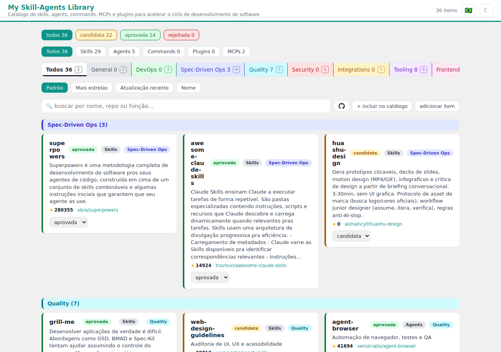

# My Skill-Agents Library


**A self-hosted CRUD catalog for the skill and plugin suggestions you run across: a decision queue, not an inventory.**

You find a skill worth trying in a tweet, a repo, a conversation. You don't
want to install it right now, but you don't want to lose track of it either.
My Skill-Agents Library is where that suggestion goes: name, source repo,
what it does, your own note on whether it's worth it, and a status
(`candidata` / `aprovada` / `rejeitada`) you flip when you actually
decide.

It is the deliberate opposite of its sibling project,
[My Harness Library](https://github.com/Epaminondaslage/my-Harness-Library):
that one inventories what is *already installed and running*. This one
tracks what you're merely *considering*. Same design lineage, same UI
system, unrelated data.

---

## Table of contents

- [What it does](#what-it-does)
- [Screenshot](#screenshot)
- [Requirements](#requirements)
- [Deploy: Docker](#deploy-docker)
- [Deploy: bare metal](#deploy-bare-metal)
- [How it works](#how-it-works)
- [GitHub enrichment](#github-enrichment)
- [Security model](#security-model)
- [Configuration](#configuration)
- [Command reference](#command-reference)
- [Uninstalling](#uninstalling)
- [Troubleshooting](#troubleshooting)
- [Project layout](#project-layout)
- [Codebase map](#codebase-map)
- [Notes for contributors](#notes-for-contributors)
- [Acknowledgments](#acknowledgments)
- [License](#license)

---

## What it does

### One-time seed, then it's yours

`src/seed.py` parses the numbered catalog table out of My Harness Library's
`Catalogo-de-Agent-Skills.md` once, at first run, into
`~/.claude/.skill-library/items.json`. From that point on the JSON file is
the sole source of truth: the markdown is never read again, and every
mutation goes through `src/api.py`.

### Classifies by kind and purpose

Every item is tagged with a **kind** (Skill, Agent, Command, Plugin, MCP)
and a **purpose** (General, DevOps, Spec-Driven Ops, Quality, Security,
Integrations, Tooling, Frontend, Other), the same eight-plus-one taxonomy
My Harness Library uses, so the two catalogs read as one system. Classification
is a deterministic keyword heuristic over the item's name and description:
no LLM call, no network, no cost. Adding an item or running the enrichment
script classifies it automatically; editing `kind`/`purpose` by hand in the
modal is sticky, and nothing ever silently reclassifies it back.

### Groups cards by purpose, color-coded

The grid is not one flat list: it's one section per purpose, each with a
colored header matching that purpose's badge, so the shape of your queue
(mostly Tooling? nothing in Security?) is visible at a glance. Filter by
status, kind, or purpose; sort by most stars, most recently updated, or
name; every filter and the sort combine.

### Pulls real GitHub data

Each item carries its repo's real star count and a link to it, fetched over
a single stdlib `urllib` HTTPS call, the one deliberate exception to this
project's offline-first stance (see [Security model](#security-model)). A
one-time `src/enrich.py` run backfills the whole catalog; a per-item
"atualizar do GitHub" button in the modal refreshes one entry on demand, any
time, without touching its classification.

### A modal, not a form maze

Click any card and every field opens in one place: name, repo, function
(a resizable ~10-line text area, not a cramped one-liner), dev note, status,
kind, purpose, your personal note, plus save/delete/refresh. Matches My
Harness Library's click-to-edit pattern instead of a wall of inline inputs.

### Writes are live, not stuck behind a static snapshot

The served page is a static site, regenerated by a request file the backend
drops and a background loop consumes. Same separation My Harness Library
uses, and for the same reason: the write-facing process is never allowed to
exec anything. But every action in the page also re-fetches the live list
and re-renders in place, so a status change or an edit shows up immediately
instead of waiting for the next regeneration pass.

### Themed, matching its sibling

Same "SPS Design System" tokens as My Harness Library: a 56px teal-accented
header, card grid, light/dark themes that follow the OS by default and
persist an explicit choice in `localStorage`.

---

## Screenshot

<picture>
  <source media="(prefers-color-scheme: dark)" srcset="docs/screenshot-dark.png">
  
</picture>

The header carries the title, an item count, and the theme toggle. Below it:
status pills, kind pills, purpose pills (colored to match), sort pills, the
add-item form, then one colored section per purpose holding that purpose's
cards.

---

## Requirements

- **Docker + Docker Compose** (recommended path), or Linux with **systemd**,
  **nginx** and **cron** for the bare-metal path
- **Python 3.9+** — standard library only. No `pip install`, nothing
  vendored, no build step.
- A user account owning `~/.claude`

Both deploy modes share the same `src/` tree; only the isolation boundary
differs (container vs. kernel-sandboxed systemd unit).

---

## Deploy: Docker

This is the deployed mode on the reference install. One container runs
nginx and the Python backend over an internal Unix socket. No host nginx
or systemd touched.

```bash
git clone https://github.com/Epaminondaslage/my-skill-agents-library.git
cd my-skill-agents-library
docker compose up -d --build
```

Published on host port **8092**. State bind-mounts from your own machine so
it survives rebuilds:

| Host path | Container path | Purpose |
|---|---|---|
| `~/.claude/.skill-library` | `/home/app/.claude/.skill-library` | items.json, audit log, regen request — read-write |
| `~/.claude/.inventory` | `/home/app/.claude/.inventory` | read-only mount kept for parity with My Harness Library; unused by this project's backend today |

Cron is replaced by an hourly loop inside `docker/entrypoint.sh`; the
container also regenerates once on startup so the page is never empty while
the socket comes up.

```bash
docker compose up -d --build   # deploy / redeploy after a code change
docker compose logs -f         # follow backend + nginx output
docker compose down            # stop and remove the container (state survives — it's bind-mounted)
```

---

## Deploy: bare metal

Mirrors My Harness Library's install shape: a hardened systemd unit for the
backend, a nginx location block, a daily cron entry.

```bash
sudo bash install.sh
```

This clones to `/opt/skill-agents-library` (root-owned; never edit files
there directly), installs `skill-agents-library.service`, injects the
`/skill-library/` location block into whichever enabled nginx vhost serves
`/var/www/html`, and adds a daily regeneration cron entry for the invoking
user.

```bash
sudo bash src/uninstall.sh
```

Removes the service, the nginx route, and the cron entry. Never touches
`~/.claude/.skill-library`, so your data survives a reinstall.

The nginx location block, if you're wiring it in by hand instead of letting
`install.sh` inject it, lives at
[`docs/nginx-snippet.conf`](docs/nginx-snippet.conf).

---

## How it works

Four pieces, deliberately kept apart:

**`src/generator.py`** renders `items.json` into a static 3-file site
(`index.html` / `app.js` / `styles.css`). Read-only over the JSON, stdlib
only, no network.

**`src/api.py`** owns the business logic (`SkillLibrary`): add, edit,
delete, set status, set note, refresh a repo's GitHub data. It is the only
module that writes to `items.json`, always via an atomic tmp-file-and-rename.

**`src/serve.py`** is the thin HTTP-over-Unix-socket wiring around `api.py`.
One nginx location proxies exactly this socket, and it dispatches actions
to `SkillLibrary` methods without ever spawning a process.

**`src/regenerate.sh`** ties it together: runs the generator when a regen
was requested (or unconditionally with `force`), and is what cron (bare
metal) or the container's hourly loop (Docker) actually calls.

### Why writes don't happen instantly on the static page

The backend can only write `items.json` and a `regen.request` timestamp.
It is structurally forbidden from running the generator itself, the same
way My Harness Library's backend cannot exec anything. Regeneration is
picked up by cron or the container loop instead. The frontend works around
the resulting latency by re-fetching the live list after every write and
re-rendering client-side, so what you see in the browser is never stale
even though the served HTML file might be, for up to an hour.

---

## GitHub enrichment

```bash
# One-time: backfill url/stars/kind/purpose for every item in items.json
python3 src/enrich.py ~/.claude/.skill-library/items.json
```

Each item's `repo` field ("owner/name") is looked up against
`api.github.com`, unauthenticated, which is enough for a personal catalog's
size and refresh cadence. A repo that 404s or times out keeps its existing
data and logs a warning; one bad entry never aborts the run. Re-running is
safe for `url`/`stars`, but reclassifies `kind`/`purpose` from scratch every
time. If you've hand-corrected an item's classification, redo it after a
bulk re-run, or use the modal's per-item refresh instead (it never touches
classification).

---

## Security model

**No password.** An earlier version gated writes behind a hash shared with
My Harness Library; it's gone. Anyone who can reach the socket can write.
The only access control is the boundary in front of it: the container, or
the systemd-sandboxed unit plus whatever fronts your nginx. Put this behind
a trusted network or your own reverse-proxy auth if it needs to be reachable
beyond one.

**The one exception to offline-first.** `refresh_repo` (the modal's
"atualizar do GitHub" button) and `src/enrich.py` make a single stdlib
`urllib` HTTPS GET to `api.github.com` for one item's repo at a time. No
token, no credentials sent, a 10-second timeout, and every failure mode
(network error, 404, malformed response) becomes a clean `ApiError` rather
than an unhandled exception. Nothing else in the backend touches the
network, and nothing spawns a process, ever.

**Bare-metal isolation is kernel-enforced.** `skill-agents-library.service`
sets `ProtectSystem=strict`, `ProtectHome=read-only`, and opens exactly one
writable path: `~/.claude/.skill-library`. `NoNewPrivileges`, an empty
capability set, `RestrictAddressFamilies=AF_UNIX AF_INET AF_INET6` (the
last two exist only for `refresh_repo`'s outbound call; nothing else in
this unit opens a socket), a syscall filter that excludes the
process-spawning families, memory and task caps.

**Docker isolation is the container boundary.** No host nginx or systemd
touched; the state and socket live inside the container filesystem, with
only `~/.claude/.skill-library` bind-mounted read-write.

**Field limits, not sanitization.** Every text field is capped (500 chars
for short fields, 5000 for `function`/`personal_note`) before it reaches
`items.json` or the generated page. Items are rendered with
`createElement`/`textContent`, never `innerHTML`, so stored text can never
be interpreted as markup.

---

## Configuration

Deliberately not much to configure:

| What | Where | Default |
|---|---|---|
| Field length caps | `MAX_SHORT_FIELD` / `MAX_LONG_FIELD` in `api.py` | 500 / 5000 chars |
| Kind/purpose keyword rules | `KIND_RULES`, `PURPOSE_RULES` in `api.py` | 5 kinds, 9 purposes |
| Docker published port | `ports:` in `docker-compose.yml` | `8092:80` |
| Container regen interval | the `sleep` in `docker/entrypoint.sh` | hourly |
| Bare-metal cron time | crontab of the installing user | 06:00 |
| State directory | `STATE` in `api.py` | `~/.claude/.skill-library` |

To correct one item's classification, edit `kind`/`purpose` in its modal.
It's sticky and survives a per-item refresh.

---

## Command reference

```bash
# Generate the static site into /var/www/html/my-skill-agents-library (bare metal)
# or wherever OUT_DIR points, without publishing
python3 src/generator.py

# Regenerate now, from the shell
bash src/regenerate.sh force

# One-time GitHub enrichment
python3 src/enrich.py ~/.claude/.skill-library/items.json

# Docker: rebuild and redeploy after a code change
docker compose up -d --build

# Docker: force a regen inside the running container
docker exec skill-agents-library /app/src/regenerate.sh force
```

---

## Uninstalling

**Docker:**

```bash
docker compose down
```

State stays on disk (bind-mounted) unless you remove
`~/.claude/.skill-library` yourself.

**Bare metal:**

```bash
sudo bash src/uninstall.sh
```

---

## Troubleshooting

**Page shows an empty catalog**
Either `items.json` doesn't exist yet (run `seed.py`, or add an item from
the page) or the static file predates your last write and hasn't been
regenerated yet. The frontend's own re-fetch-after-write should already
show the current state in the browser regardless; if it doesn't, check that
`serve.py` is actually running and the socket is reachable.

**`atualizar do GitHub` returns an error**
Either the repo string doesn't match `owner/name`, the repo doesn't exist
on GitHub (404), or you've hit GitHub's unauthenticated rate limit. Wait
and retry, or add a token if you script bulk refreshes.

**Docker: `docker compose up` starts but the page 502s**
Give the container a couple of seconds: `serve.py` and the regen loop
start in the background before nginx takes over in the foreground. Check
`docker compose logs -f`.

**Bare metal: nginx route missing after install**
`install.sh` only injects into a vhost whose `root` is `/var/www/html`. If
none exists, wire `docs/nginx-snippet.conf` into your own vhost by hand.

---

## Project layout

```
my-skill-agents-library/
├── install.sh                        bare-metal bootstrap
├── docker-compose.yml / Dockerfile   Docker deploy
├── docker/
│   ├── entrypoint.sh                 container init: state dirs, backend, regen loop, nginx
│   └── nginx.conf                    the container's whole nginx config
├── docs/
│   ├── CODEBASE_MAP.md               architecture, module guide, data flow diagrams, gotchas
│   ├── nginx-snippet.conf            the location block install.sh injects
│   └── screenshot-{light,dark}.png
├── README.md
├── CLAUDE.md                         summary and working rules for Claude Code sessions
└── src/
    ├── generator.py                  items.json -> static site
    ├── api.py                        CRUD business logic (SkillLibrary), GitHub fetch
    ├── serve.py                      Unix-socket JSON wiring around api.py
    ├── seed.py                       one-time importer from Catalogo-de-Agent-Skills.md
    ├── enrich.py                     one-time bulk GitHub enrichment
    ├── regenerate.sh                 generate + record regen status
    ├── skill-agents-library.service.in   systemd unit template (bare metal)
    └── uninstall.sh                  bare-metal removal
```

Nothing is generated at build time and no dependency is vendored. What you
read is what runs.

---

## Codebase map

[docs/CODEBASE_MAP.md](docs/CODEBASE_MAP.md) is the developer-facing
companion to this README: an architecture diagram of how the browser,
nginx, the backend and the state directory fit together; a module guide
for every file in `src/` (key exports, dependents, gotchas); sequence
diagrams for a write's full lifecycle and for the `refresh_repo` GitHub
call; the project's conventions; a list of gotchas already paid for; and a
navigation guide for a given change, which files to touch.

Generated with [Cartographer](https://github.com/kingbootoshi/cartographer)
and kept in the repository so it is versioned with the code.

## Notes for contributors

Before opening a PR:

```bash
bash -n install.sh src/regenerate.sh src/uninstall.sh
python3 -m py_compile src/*.py
python3 -m unittest discover tests
python3 -c "from src.generator import render_app_js; open('/tmp/app.js','w').write(render_app_js())"
node --check /tmp/app.js
```

---

## Acknowledgments

- [My Harness Library](https://github.com/Epaminondaslage/my-Harness-Library) — the sibling project this one borrows its design system, security posture, and deploy-mode shape from. Its `classify()`/`CATEGORY_RULES` heuristic is the direct ancestor of this project's `classify_kind`/`classify_purpose`.
- [Cartographer](https://github.com/kingbootoshi/cartographer) — generated [`docs/CODEBASE_MAP.md`](docs/CODEBASE_MAP.md).
- Built with [Claude Code](https://claude.com/claude-code).

## License

MIT. See [LICENSE](LICENSE).

Not affiliated with Anthropic.
