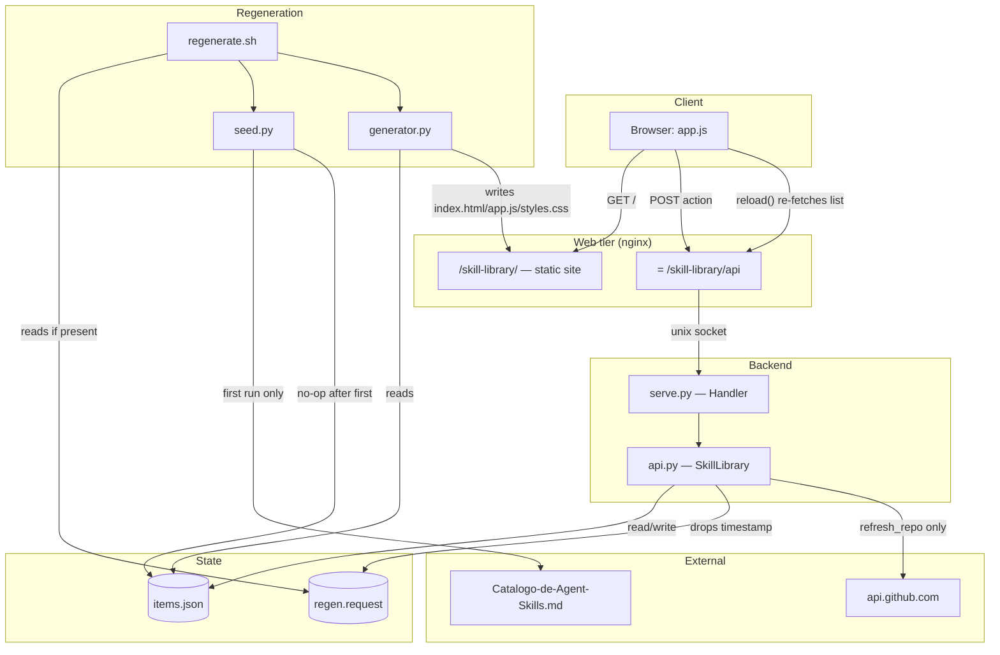
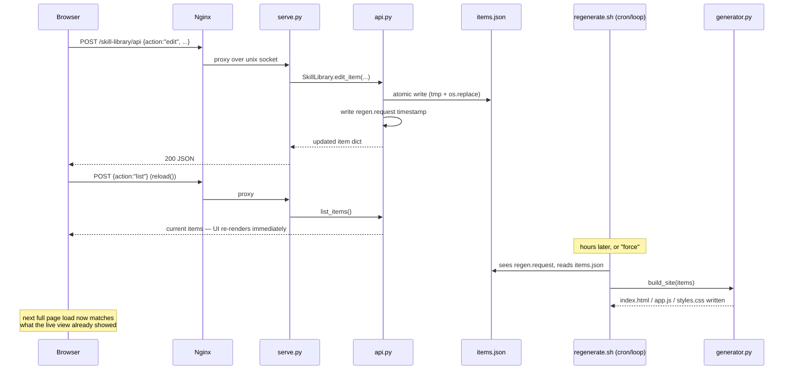
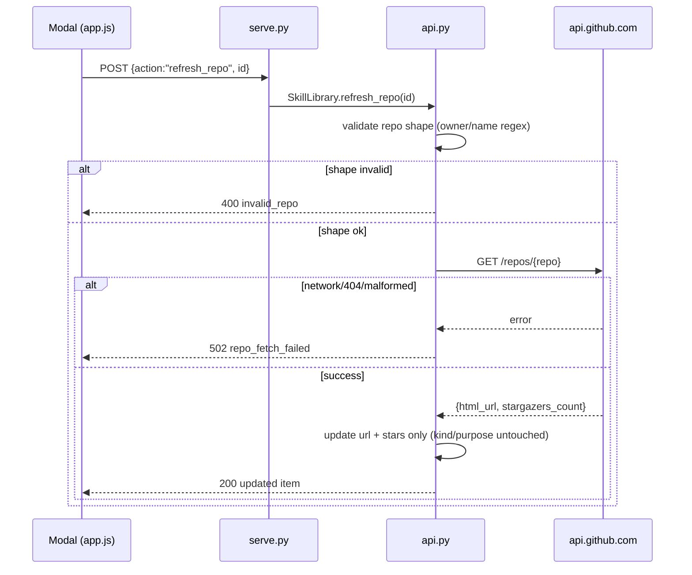

# Codebase Map

> Auto-generated by Cartographer. Last mapped: 2026-09-02T01:39:15Z

Self-hosted, offline-first CRUD catalog for skill/agent/plugin suggestions.
Stdlib Python + bash + nginx + cron, no build step, two deploy modes sharing
one `src/` tree.

## System Overview



Cron (bare metal) or an hourly in-container loop (Docker) invoke
`regenerate.sh`; nothing in the live request path ever spawns a process,
and `refresh_repo` is the one code path in the running backend that touches
the network at all.

## Directory Structure

```
my-skill-agents-library/
├── install.sh                        bare-metal bootstrap (curl | sudo bash target)
├── docker-compose.yml / Dockerfile   Docker deploy (single container)
├── docker/
│   ├── entrypoint.sh                 container init: state dirs, backend, hourly regen loop, nginx
│   └── nginx.conf                    the container's entire nginx config
├── docs/
│   ├── CODEBASE_MAP.md               this file
│   ├── nginx-snippet.conf            the location block install.sh injects into a host vhost
│   ├── screenshot-{light,dark}.png
│   └── superpowers/                  brainstorm specs + implementation plans for past features
├── README.md                         end-user docs: deploy, security model, troubleshooting
├── CLAUDE.md                         terse working rules for Claude Code sessions
└── src/
    ├── api.py                        CRUD business logic (SkillLibrary), classifier, GitHub fetch
    ├── serve.py                      Unix-socket JSON wiring around api.py
    ├── generator.py                  items.json -> static 3-file site
    ├── seed.py                       one-time importer from Catalogo-de-Agent-Skills.md
    ├── enrich.py                     one-time bulk GitHub enrichment (never in the live path)
    ├── regenerate.sh                 bridges async writes and static rendering
    ├── skill-agents-library.service.in   hardened systemd unit template (bare metal)
    └── uninstall.sh                  bare-metal removal (reverses install.sh)
tests/
    ├── test_api.py                   heaviest suite: classifier, CRUD, validation, refresh_repo
    ├── test_enrich.py                enrich_items pure-function + main() file round-trip
    ├── test_generator.py             HTML/JS/CSS content assertions, XSS-escape check
    ├── test_seed.py                  markdown table parsing, import-once semantics
    └── test_serve.py                 full-stack: real server over a real Unix socket
```

## Module Guide

### `src/api.py` — CRUD business logic

**Purpose**: Owns every read/write to `items.json`; the only module that mutates state.
**Entry point**: imported by `serve.py` and `enrich.py` — never run standalone.

| Export | Purpose |
|---|---|
| `SkillLibrary` | `add_item`, `edit_item`, `delete_item`, `set_status`, `set_note`, `refresh_repo`, `list_items` |
| `classify_kind(name, function)` / `classify_purpose(name, function)` | deterministic keyword heuristic, no LLM/network |
| `fetch_repo_info(repo, fetch_fn=None)` | the one network call in the whole backend |
| `ApiError` | carries HTTP status + a stable `code` the frontend branches on |
| `KINDS`, `PURPOSES`, `KIND_RULES`, `PURPOSE_RULES`, `STATUSES`, `FIELD_LIMITS` | classification and validation constants |

**Dependencies**: stdlib only (`json`, `os`, `re`, `urllib.request`/`urllib.error`, `uuid`, `datetime`, `pathlib`).
**Dependents**: `serve.py`, `enrich.py`, `regenerate.sh` (indirectly, via the file it writes), `test_api.py`, `test_serve.py`.

**Patterns**: atomic writes (`tmp.write_text` + `os.replace`); every write queues a regen via a `regen.request` timestamp; validate-before-mutate (`edit_item` validates every field before touching the item); stable error codes.

**Gotchas**:
- `KIND_RULES`/`PURPOSE_RULES` are ordered regex lists — first match wins. Kind is classified before purpose so `"github-mcp"` lands as `mcp` kind even though its text also matches the `integrations` purpose pattern.
- Unmatched text defaults to `kind="skill"`, `purpose="other"`.
- `refresh_repo` never touches `kind`/`purpose` — classification is sticky once set, by hand or automatically.
- `fetch_repo_info` validates repo shape (`^[A-Za-z0-9._-]+/[A-Za-z0-9._-]+$`) *before* building the GitHub URL — this is what rejects path-traversal-shaped strings.
- `_write` always calls `_queue_regen()` — there is no way to persist a change without also requesting a regen.

### `src/enrich.py` — one-time bulk GitHub enrichment

**Purpose**: Backfills `url`/`stars` and recomputes `kind`/`purpose` for every item, run by hand.
**Entry point**: `python3 src/enrich.py <items.json>`.

**Exports**: `enrich_items(items, fetch_fn=None)` (pure function), `main(items_path, fetch_fn=None)`.
**Dependencies**: `api.classify_kind`, `api.classify_purpose`, `api.fetch_repo_info`, `api.ApiError` (via `sys.path.insert`, not a package import).
**Dependents**: nothing in the runtime path — its own header comment states it is "never invoked by serve.py/api.py or cron." Only `test_enrich.py` and the README's command reference call it.

**Gotchas**: a bad repo (404/network error) is caught, logged to stderr, never aborts the batch. **Reclassifies `kind`/`purpose` from scratch on every run** — this overwrites any hand-correction made through the modal. The README warns about this explicitly; there is no flag to skip reclassification.

### `src/generator.py` — static site renderer

**Purpose**: Pure renderer, read-only over `items.json`, emits `index.html`/`app.js`/`styles.css`.
**Entry point**: `__main__` calls `build_site(ITEMS_FILE)`; also invoked inline by `regenerate.sh`.

| Function | Purpose |
|---|---|
| `render_index_html(items)` | embeds items as an escaped JSON `<script>` payload |
| `render_app_js()` | the entire frontend: filters, purpose-grouped sections, modal, theme toggle |
| `render_styles_css()` | 3-tier theming (light default / OS-dark / explicit-dark override) |
| `build_site(items_path, out_dir=OUT_DIR)` | orchestrates all three, handles missing/corrupt `items.json` |

**Dependencies**: stdlib only. Deliberately does **not** import `api.py`.
**Dependents**: `regenerate.sh`, the CLI entry point, `test_generator.py`.

**Frontend structure (inside `render_app_js()`)**:
- State: `items`, `filterStatus`, `filterKind`, `filterPurpose`, `sortBy`, `openModalId`, `addModalOpen`/`addModalPrefillName` (add-item modal), plus search state `searchQuery`, `ghResults`, `ghLoading`, `ghError`, `ghAddedRepos`, plus i18n state `lang` — plain globals, re-rendered wholesale on every mutation via `render()`.
- **i18n** (pt default / en / es): `LANGS`, `LANG_FLAG` (toggle-button emoji per lang), and `STRINGS[lang]` (per-lang dict of UI-chrome strings — plain keys, function keys like `itemsCount(n)`/`ghResultsFound(n)`/`confirmDelete(name)`/`errGeneric(status)`, and nested `status`/`kind`/`purpose`/`sort` label maps). `currentLang()` reads `localStorage["lang"]` (default `"pt"`), `setLang()` writes it. `t(key)` and the `statusLabel()`/`kindLabel()`/`purposeLabel()`/`sortLabel()` helpers resolve from `STRINGS[lang]`, falling back to `STRINGS.pt` if the lang or key is missing — these fully replaced the old plain `STATUS_LABEL`/`KIND_LABEL`/`PURPOSE_LABEL`/`SORT_LABEL` consts, which no longer exist. `renderLangToggle()` sits next to `renderThemeToggle()` in the topbar and cycles `LANGS` (🇧🇷→🇺🇸→🇪🇸) on click. **Item data** (`name`/`function`/`dev_note`/`personal_note`) is never translated — `STRINGS` covers only UI chrome. Gotcha: inside `renderModal()`, the field-label `<label>` elements are named `statusFieldLabel`/`kindFieldLabel`/`purposeFieldLabel` (not `statusLabel`/etc.) specifically to avoid shadowing the global label-helper functions of the same name, which that function still calls.
- `call(action, body)` POSTs to `/skill-library/api`; on failure throws an `Error` carrying `.code`/`.status` from the JSON error body.
- `reload()` re-fetches the full list and re-renders client-side after every write — this is what hides the static page's regeneration latency from the user.
- `renderSearchBox()` builds the local search input (filters `items` by name/repo/function substring, combined with the status/kind/purpose filters, purely client-side) plus a GitHub-mark button, a "+ incluir no catálogo" button that opens the add-item modal prefilled with the search text, and a plain "adicionar item" button that opens the same modal empty. Rendered below the status/kind/purpose/sort filters, not above them.
- `renderFilters()` (status) and `renderPurposeFilter()` both color each pill/tab to match that value's card badge — `renderPillRow(className, allLabel, options, labelFn, active, onPick, countFn, colorClassFn)` is the shared pill-list builder (`colorClassFn` is optional, used by status → `"badge-"+s"` and previously by purpose). `renderPurposeFilter()` no longer calls `renderPillRow`: it returns a `.purpose-tab-wrap` containing the `.purpose-tabs`/`.purpose-tab` row (one full-width tab bar instead of a wrapping pill line, same `pill-purpose-*` color classes) plus a `.purpose-tab-accent` strip — a folder-tab effect: the active tab drops its bottom border (`.purpose-tab.active` backgrounds to `--bg`, merging into the page) and the accent strip below is set inline (`accent.style.background`) to that purpose's own `--c-<purpose>-fg` var, or `--accent` for "Todos" (`filterPurpose` null). Each tab carries a `<kbd class="tab-shortcut">` hint from `PURPOSE_TAB_KEYS` (`"1"` = Todos, `"2"..."9"` = each `PURPOSES` entry in order — `purposeTabTarget(key)` maps a key back to the purpose). A `document`-level `keydown` handler drives the same jump: any digit in `PURPOSE_TAB_KEYS`, outside an `INPUT`/`TEXTAREA`/`SELECT` and while no modal is open, sets `filterPurpose` and re-renders. `filterPurpose` still defaults to `null` ("Todos"), unchanged. Render order in `render()`: status pills, kind pills, sort pills, then the purpose tab bar, then the search box.
- `renderAddModal()` / `openAddModal(prefillName)` / `closeAddModal()`: the add-item form (`EDITABLE` fields) now lives in a modal overlay (`addModalOpen` state), not a permanently-rendered card — same overlay/close pattern as `renderModal(item)`, closable via the "✕" button, a click on the overlay backdrop, or Escape.
- `searchGithub()` does a direct, unauthenticated `fetch` to `api.github.com/search/repositories` from the browser — bypasses `api.py` entirely, so it's the one place besides `refresh_repo`/`enrich.py` that talks to GitHub, but from the client rather than the server (keeps the offline-first backend contract intact). Subject to GitHub's ~10 req/min unauthenticated rate limit.
- `renderGithubResults()` / `renderGithubResultsHeader()` render the loading/error/empty/populated states of the GitHub search panel (name, description, ★ stars, link, a per-result "+ incluir" that POSTs `action: "add"` directly, and a "✕" that clears `ghResults`).
- `renderSections()` groups filtered items by `purpose` in fixed order, one colored section per purpose — including empty ones, which still render the header bar plus a "nenhum item aqui" placeholder instead of being omitted, so the tab bar's purpose colors stay a stable landmark whether or not a purpose currently has matches. The header shows a count only for the section matching the active tab (`purpose === filterPurpose`) — the tab bar already carries every purpose's count, so repeating it on every section in the "Todos" view would be noise, but the single section shown once a tab is selected gets its own "(n)" back.
- `renderModal(item)` is the single edit surface: every `EDITABLE` field (`function` is a `<textarea>`, not `<input>`), plus `status`/`kind`/`purpose` selects, `personal_note`, and save/delete/refresh-from-GitHub actions. Save batches `edit` + conditional `set_status` + conditional `set_note` in one `Promise.all`.
- Every DOM node is built with `createElement`/`textContent` — never `innerHTML` for item/repo data — the render-side half of the XSS defense (the write-side half is `api.py`'s field length caps and `_json_for_script_tag`'s `</script>` escape). The only `.innerHTML` uses are static trusted constants (`GITHUB_MARK_SVG`, the "✕" glyph), never data from `items.json` or the GitHub API.

**Gotchas**: a missing `items.json` is treated as the normal first-run state (warn + empty site); a *corrupt* one raises, never silently rendered as "empty." `render()` fully clears and rebuilds `#app` on every keystroke in search — it explicitly saves/restores the search `<input>`'s focus and caret (`selectionStart`) across that rebuild, since a naive full-DOM-replace would otherwise steal focus on every character typed. `ghResults` is tri-state (`null` = never searched, `[]` = zero matches, array = results) to distinguish "hidden panel" from "empty results panel."

### `src/seed.py` — one-time markdown importer

**Purpose**: Parses `Catalogo-de-Agent-Skills.md` (from the sibling project, My Harness Library) into `items.json`, exactly once.
**Exports**: `parse_catalog_markdown(md_text)`, `import_catalog(md_path, items_path, now=None)`.

**Behavior**: parses only the *first* markdown table (stops at the first non-`|` line once inside the table); skips the header row and the alignment row; maps columns `# | Skill | Repo | Stars | Installs | Função | Nota Dev` → `name, repo, function, dev_note` (the catalog's own `Stars`/`Installs` columns are read but not carried through — see gotcha below); imports `classify_kind`/`classify_purpose` from `api.py` to classify each row the same way `add_item` does; strips backticks and a leading `⭐` per cell.

**Gotchas**:
- `import_catalog` is a permanent no-op the moment `items_path` exists — it never overwrites.
- **Fixed schema divergence**: the catalog's own `Stars` column is a formatted placeholder (`"242,8K"`, `"~102K"`, `"<1K"`), not a real count in a parseable shape — seeded items now get the same schema `add_item` produces (`stars=0` int, `url` derived from `repo`, `kind`/`purpose` classified) instead of carrying that placeholder text through. A seeded item is indistinguishable from a manually-added one until `enrich.py` or a per-item refresh fills in real GitHub data.

### `src/serve.py` — Unix-socket JSON server

**Purpose**: Thin HTTP-over-`AF_UNIX` wiring dispatching JSON `action` requests to `SkillLibrary` methods.
**Entry point**: `run(socket_path)`, called from `__main__` and by both deploy modes' process supervisors.

**Actions dispatched**: `list`, `add`, `edit`, `delete`, `set_status`, `set_note`, `refresh_repo`.
**Dependencies**: `api.ApiError`, `api.SkillLibrary`.
**Dependents**: `skill-agents-library.service.in` (`ExecStart`), `docker/entrypoint.sh`, nginx (`proxy_pass` to the socket), `test_serve.py`.

**Gotchas**: unknown/missing action → 400 `unknown_action`; any non-`ApiError` exception → 500 with a plain message, never a raw stack trace; access logging is silenced (`log_message` overridden to a no-op); the socket is unlinked and recreated with mode `0660` on every `run()`; **structurally cannot spawn a process**, which is exactly why regeneration is queued to `regenerate.sh` instead of run in-process.

### `src/regenerate.sh` — regen orchestrator

**Purpose**: The only thing that invokes `generator.build_site`; bridges the backend's async writes and the static renderer.
**Modes**: `cron` (only runs if `regen.request` exists) vs `force` (always runs).
**Sequence**: runs `seed.py` first (no-op after the first successful import) → invokes `generator.build_site` inline via `python3 -c`.
**Dependents**: `install.sh` (daily 06:00 cron entry), `docker/entrypoint.sh` (hourly loop + startup run), README's command reference.

**Gotcha**: takes a "stamp" (request-file content + mtime) *before* regenerating and compares it *after* — if a new write races in mid-regeneration, the request file is deliberately **not** deleted, so that write's changes get picked up by the next pass instead of being silently dropped.

### `src/skill-agents-library.service.in` — systemd unit template (bare metal)

**Purpose**: Hardened systemd unit; `install.sh` substitutes `@RUN_USER@`/`@USER_HOME@` and installs the result.

**Isolation**: `ReadWritePaths=@USER_HOME@/.claude/.skill-library` is the only writable path; `ProtectSystem=strict`, `ProtectHome=read-only`; `NoExecPaths=/` with a narrow `ExecPaths` allowlist (python3 + libs only — `/bin/sh` stays non-executable); empty `CapabilityBoundingSet`; `RestrictAddressFamilies=AF_UNIX AF_INET AF_INET6`; a syscall filter excluding process-spawning families; `MemoryMax=128M`, `TasksMax=16`.

**Fixed inconsistency**: `RestrictAddressFamilies` used to be `AF_UNIX` only, which would have blocked the HTTPS call `refresh_repo` needs to reach `api.github.com` — the bare-metal unit's hardening and the documented "atualizar do GitHub" feature would have contradicted each other. `AF_INET`/`AF_INET6` are now allowed alongside `AF_UNIX`; nothing else in this service opens a socket, so this stays as narrow as the feature allows.

### `src/uninstall.sh` — bare-metal removal

**Purpose**: Reverses `install.sh` — stops/disables/removes the systemd unit, strips the marker-delimited nginx block (with a timestamped backup first), removes the cron line, deletes `/opt/skill-agents-library` and the generated webroot. **Never touches** `~/.claude/.skill-library`.

### `install.sh` — bare-metal bootstrap

**Purpose**: `curl | sudo bash` installer, idempotent on re-run.
**Sequence**: clone/pull to `/opt/skill-agents-library` → template + install the systemd unit → inject nginx location blocks into whichever enabled vhost has `root /var/www/html;` (prefers the TLS vhost) between marker comments, backing up the vhost first → install a daily 06:00 cron entry (guarded against duplication) → create the webroot (`RUN_USER:www-data`, mode `2775`) → run `regenerate.sh force` once.

**Gotcha**: on `nginx -t` failure after injection, the script warns but the rewritten (broken) config file is left in place on disk — nginx itself keeps serving its last successfully *loaded* config in memory since no reload happens, but the on-disk file no longer matches what's running until someone fixes and reloads it by hand.

### Docker deploy (`Dockerfile`, `docker-compose.yml`, `docker/`)

**Dockerfile**: `python:3.11-slim` base, installs nginx via apt, creates an unprivileged `app` user, copies `src/` and the docker config, `EXPOSE 80`, `ENTRYPOINT ["/entrypoint.sh"]`.

**docker-compose.yml**: single service, port `8092:80`. Two bind mounts:
| Host | Container | Purpose |
|---|---|---|
| `~/.claude/.skill-library` | `/home/app/.claude/.skill-library` | read-write, state |
| `~/.claude/.inventory` | `/home/app/.claude/.inventory` | read-only — labeled "shared auth hash from My Harness Library"; **vestigial**, unused since this project's own password auth was removed |

**docker/entrypoint.sh**: creates/chowns state, socket (`0770`), and webroot (`2775`) dirs; backgrounds `serve.py` under `su -s /bin/bash app`; runs `regenerate.sh force` synchronously once (so the page isn't empty on first boot); backgrounds an infinite `sleep 3600` loop calling `regenerate.sh cron`; finally `exec nginx -g "daemon off;"` as PID 1.

**Gotcha**: the backgrounded `serve.py` and regen loop are **not supervised** — if `serve.py` crashes inside the container, nothing restarts it (unlike the bare-metal unit's `Restart=on-failure`). Only nginx exiting stops the container.

**docker/nginx.conf**: the container's entire nginx config — `/` redirects to `/skill-library/`; `/skill-library/` serves the static site with SPA-style fallback; `= /skill-library/api` proxies to the Unix socket. Same route shape as the block `install.sh` injects on bare metal.

## Data Flow

### Write → live UI → eventual static regen



### `refresh_repo` — the one network call



## Conventions

- **Stdlib-only, no build step.** Nothing is generated at build time and no dependency is vendored across both `src/` and the frontend it emits.
- **Atomic writes everywhere state is persisted**: tmp file + `os.replace`, never a partial write visible to a concurrent reader.
- **Stable error codes** (`ApiError.payload["code"]`) so the frontend can branch on failure type instead of parsing messages.
- **The backend never spawns a process** — this is enforced both by code (nothing calls `subprocess`) and, on bare metal, by the kernel (`skill-agents-library.service.in`'s syscall filter).
- **XSS defense is two-sided**: field length caps + `</script>` escaping on write (`api.py`, `_json_for_script_tag`), `createElement`/`textContent` only on render (`generator.py`'s emitted JS) — neither side alone is trusted.
- **Classification is sticky by design**: anything that sets `kind`/`purpose` by hand or via `add_item`'s one-time classification survives `refresh_repo`; only a full `enrich.py` re-run resets it.

## Gotchas

- ~~`seed.py`'s `stars` was a string, `api.py`'s an int~~ — **fixed**: `seed.py` now produces the exact same shape `add_item` does (int `stars=0`, derived `url`, classified `kind`/`purpose`).
- ~~The bare-metal systemd unit's `RestrictAddressFamilies=AF_UNIX` conflicted with `refresh_repo`~~ — **fixed**: `AF_INET`/`AF_INET6` added alongside `AF_UNIX`.
- **`enrich.py` reclassifies unconditionally on every run**, silently discarding hand-corrected `kind`/`purpose` values. Re-running it on a catalog someone has manually curated is destructive to that curation.
- **`docker-compose.yml`'s `.inventory` read-only mount is vestigial** — labeled for a shared password hash that no longer exists in this codebase (auth was removed). It costs nothing to keep but documents a dependency that isn't real anymore.
- **`install.sh` can leave a broken nginx config on disk** without reloading nginx, so `nginx -t`'s failure doesn't roll anything back — it just stops short of the reload.
- A `docker/entrypoint.sh` background job (backend or regen loop) crashing goes unnoticed and unrestarted; only nginx exiting stops the container, unlike the bare-metal unit's `Restart=on-failure`.

## Navigation Guide

**To add a new CRUD action**: add a method to `SkillLibrary` in `src/api.py` → dispatch it in `src/serve.py`'s `do_POST` → call it from `src/generator.py`'s `render_app_js()` via `call(action, body)` → cover it in `tests/test_api.py` and `tests/test_serve.py`.

**To change the item schema**: add the field to `SkillLibrary.add_item`/`edit_item` in `src/api.py`, update `FIELD_LIMITS`/`EDITABLE_FIELDS` as needed, render it in `renderItem`/`renderModal` in `src/generator.py`, and decide whether `src/enrich.py` needs to backfill it for existing items.

**To adjust the kind/purpose taxonomy**: edit `KIND_RULES`/`PURPOSE_RULES`/`KINDS`/`PURPOSES` in `src/api.py`, and the matching `KIND_LABEL`/`PURPOSE_LABEL` plus the CSS color tokens (`--c-<purpose>-bg/fg`) in `src/generator.py`'s `render_styles_css()`.

**To change either deploy mode**: bare metal touches `install.sh`, `src/uninstall.sh`, and `src/skill-agents-library.service.in`; Docker touches `Dockerfile`, `docker-compose.yml`, and `docker/entrypoint.sh`/`docker/nginx.conf`. Keep the nginx route shape (`/skill-library/` alias + `= /skill-library/api` proxy) identical between `docker/nginx.conf` and `docs/nginx-snippet.conf` — they are meant to be the same block.

**To regenerate the static site by hand**: `bash src/regenerate.sh force` (reads `items.json`, ignores whether a regen was requested).

**To test a schema or classifier change end to end**: `python3 -m unittest discover tests`, then `python3 -c "from src.generator import render_app_js; open('/tmp/app.js','w').write(render_app_js())" && node --check /tmp/app.js`.
